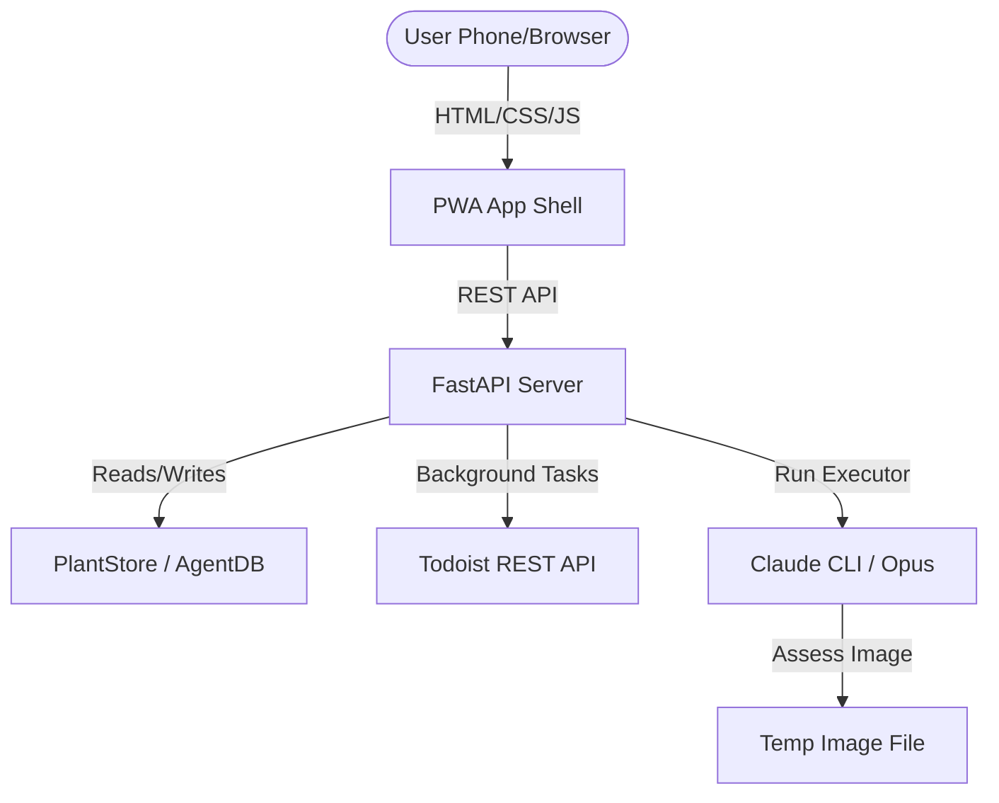

# Design Doc: FloraPulse Plant PWA

## Problem / Context
The personal AI agent workspace has a rich plant management backend (`PlantStore` database, hourly `PlantAgent` weather adjustment logic, profiles, etc.), but its only UI was a Telegram text bot.
This project implements FloraPulse, a mobile-first Progressive Web App (PWA) served over Tailscale. It provides:
1. A status overview dashboard (overdue-first plant cards).
2. Full CRUD capability to add, edit, and remove plants.
3. In-app photo upload + Claude Opus-based plant health analysis.
4. Auto-completion/syncing of Todoist tasks.

## Design Decisions
- **Authentication**: Bound to Tailscale only (`<TAILSCALE_IP>:8765`). Since it operates on a secure, private Tailscale mesh, no login screen or credentials are required.
- **Tech Stack**:
  - **FastAPI**: Lightweight REST API + static file serving (no complex server-side render).
  - **Alpine.js**: Ultra-lightweight SPA framework loaded via CDN (no Node.js build step).
  - **Marked.js**: Markdown parser loaded via CDN to render plant profiles.
  - **Vanilla CSS**: Curated forest-green glassmorphism palette, custom micro-animations, and full mobile-first responsiveness.
  - **Pillow**: Used during build to generate 192px/512px PWA home screen icons.
- **Integration**:
  - **BackgroundTasks**: Used to complete/close Todoist tasks asynchronously to keep UI response times snappy.
  - **AgentDB Thread-Safety**: Configured `check_same_thread=False` on the SQLite connector to allow safe access across worker threads.
  - **Service Worker**: Served from the root `/sw.js` to ensure its scope spans the entire app, caching static resources offline.

## Architecture & Data Flow



## Data Model & Computed Fields
The SQLite database stores plant records via `PlantStore` under `"daily-briefing"`:
```python
class Plant(BaseModel):
    name: str
    frequency_days: int
    baseline_frequency_days: int
    last_watered: date
    location: Literal["indoor", "outdoor"] = "indoor"
    sunlight: str = ""
    water_sensitivity: Literal["high", "medium", "low"] = "medium"
    last_assessment: Optional[AssessmentRecord] = None
    needs_photo: bool = False
```

### Computed Fields in API
- `next_due_date` = `last_watered + frequency_days`
- `overdue_days` = `max(0, (today - next_due_date).days)`
- `status_label` = `last_assessment.status` if available, else `"Unknown"`

## API Endpoints

| Method | Path | Input / Body | Purpose |
|--------|------|--------------|---------|
| `GET` | `/api/plants` | None | All plants + computed fields, sorted overdue-first |
| `GET` | `/api/plants/{name}` | None | Retrieve single plant + markdown profile content |
| `POST` | `/api/plants` | `PlantCreate` JSON | Add new plant, create profile markdown file |
| `PATCH` | `/api/plants/{name}` | `PlantUpdate` JSON | Update plant fields, log frequency change in profile history |
| `DELETE` | `/api/plants/{name}` | None | Remove plant from database, delete profile markdown |
| `POST` | `/api/plants/{name}/water` | None | Water a single plant, close open Todoist task |
| `POST` | `/api/plants/water-all` | `WaterAllRequest` | Water all plants at a location, close respective Todoist tasks |
| `POST` | `/api/plants/{name}/photo` | Multipart File | Upload photo, run Claude Opus assessment, write profile health notes |
| `GET` | `/api/weather` | None | Get plant weather adjustment cache |
| `GET` | `/api/status` | None | Check background plant-agent cron gate runtimes |
| `GET` | `/` | None | Serve index.html SPA shell |
| `GET` | `/sw.js` | None | Serve Service Worker with root-level scope |

## File list
- **`plant_ui/server.py`**: FastAPI application, REST endpoints, database sync, Todoist client wrapper, image assessment adapter.
- **`plant_ui/requirements.txt`**: Package dependencies (fastapi, uvicorn, python-multipart, aiofiles, python-dotenv, httpx, pillow).
- **`plant_ui/plant_ui.service`**: Systemd user service template.
- **`plant_ui/templates/index.html`**: Alpine.js SPA page structure, modals, CSS/JS links.
- **`plant_ui/static/style.css`**: Mobile-first premium styles, glassmorphism panels, card layouts, loading indicators.
- **`plant_ui/static/app.js`**: Alpine.js SPA controller logic, REST client calls, date formatting, markdown rendering.
- **`plant_ui/static/manifest.json`**: PWA properties (standalone, colors, icon registry).
- **`plant_ui/static/sw.js`**: PWA service worker offline caching shell.
- **`plant_ui/static/icon-192.png` / `icon-512.png`**: Green theme PNG application icons.
- **`tests/test_plant_ui_api.py`**: Complete pytest coverage of all REST endpoints, file operations, and photo analyzer flow.
